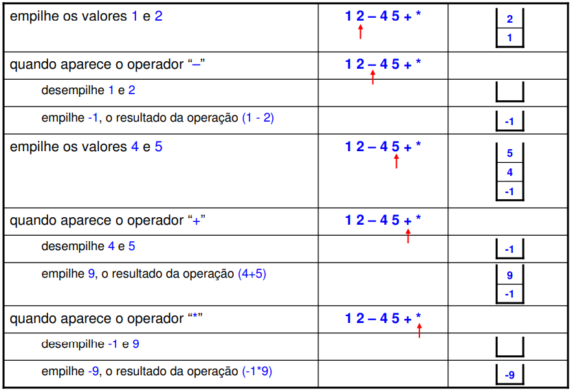

# Informações

  Uma calculadora pós-fixada, também conhecida como calculadora RPN (Reverse Polish Notation), é uma ferramenta poderosa que permite realizar cálculos de forma eficiente e precisa. Ao contrário das calculadoras tradicionais, que operam na ordem infixa (operador entre operandos), as calculadoras pós-fixadas operam na ordem posfixa (operando seguido de operador).

# Uso

Para usar uma calculadora pós-fixada:

1. Digite o primeiro operando.
2. Digite o segundo operando.
3. Digite o operador.
4. Observe o resultado na tela.

Observe como a Calculadora Pós-Fixada funciona pictoricamente!

# Exemplo

Para calcular 2 + 3, você digitaria: 

1. 2
2. 3
4. °

O resultado, 5, então seria exibido na tela.

# Vantagens

Vantagens da calculadora pós-fixada:

- **Eficiência:** A ordem posfixa permite realizar cálculos mais rapidamente, pois não é necessário usar parênteses para indicar a ordem das operações.
- **Precisão:** A ordem posfixa elimina a ambiguidade na ordem das operações, reduzindo o risco de erros.
- **Versatilidade:** As calculadoras pós-fixadas podem realizar cálculos complexos com mais facilidade do que as calculadoras tradicionais.

# Desvantagens

- **Curva de aprendizado:** A ordem posfixa pode ser estranha no início para usuários acostumados com calculadoras tradicionais.
- **Falta de recursos:** Algumas calculadoras pós-fixadas não possuem recursos avançados presentes em calculadoras tradicionais.

# Para que serve

As calculadoras pós-fixadas são usadas em diversas áreas, como:

- **Engenharia:** Para realizar cálculos complexos de matemática, física e engenharia.
- **Ciência:** Para realizar cálculos científicos e estatísticos.
- **Finanças:** Para realizar cálculos financeiros e de investimento.
- **Programação:** Para realizar cálculos em linguagem de programação.